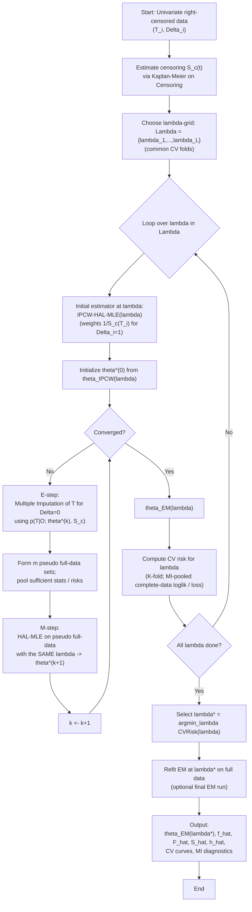

Here’s a clean Mermaid flowchart matching your pipeline (IPCW init → EM with MI → reuse λ in M-step → outer CV over λ):

```mermaid
flowchart TD
  A["Start: Univariate right-censored data<br/>(T_i, Delta_i)"] --> B["Estimate censoring S_c(t)<br/>via Kaplan-Meier on Censoring"]
  B --> C["Choose lambda-grid: Lambda = {lambda_1,...,lambda_L}<br/>(common CV folds)"]
  C --> D{"Loop over lambda in Lambda"}

  D --> E["Initial estimator at lambda:<br/>IPCW-HAL-MLE(lambda)<br/>(weights 1/S_c(T_i) for Delta_i=1)"]
  E --> F0["Initialize theta^(0) from theta_IPCW(lambda)"]
  F0 --> G{"Converged?"}
  G -->|No| H1["E-step:<br/>Multiple Imputation of T for Delta=0<br/>using p(T|O; theta^(k), S_c)"]
  H1 --> H2["Form m pseudo full-data sets;<br/>pool sufficient stats / risks"]
  H2 --> H3["M-step:<br/>HAL-MLE on pseudo full-data<br/>with the SAME lambda -> theta^(k+1)"]
  H3 --> H4["k <- k+1"]
  H4 --> G
  G -->|Yes| I["theta_EM(lambda)"]

  I --> J["Compute CV risk for lambda<br/>(K-fold; MI-pooled complete-data loglik / loss)"]
  J --> K{"All lambda done?"}
  K -->|No| D
  K -->|Yes| L["Select lambda* = argmin_lambda CVRisk(lambda)"]
  L --> M["Refit EM at lambda* on full data<br/>(optional final EM run)"]
  M --> N["Output:<br/>theta_EM(lambda*), f_hat, F_hat, S_hat, h_hat,<br/>CV curves, MI diagnostics"]
  N --> O[End]
```
