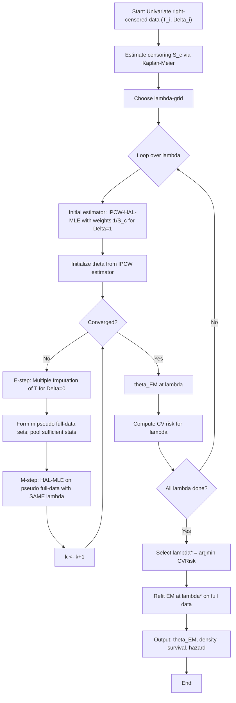

# Censored Data Density Estimation Module

This module provides HAL-based density estimation for censored data:

- **Right-censoring**: IPCW-weighted HAL-MLE and EM refinement
- **Interval-censoring**: Midpoint initialization and EM refinement

## Estimators

| Estimator | Description |
|-----------|-------------|
| `RightCensoredInitEstimator` | Stage 1 IPCW-weighted HAL for right-censored data |
| `RightCensoredEMEstimator` | Combined Stage 1 + Stage 2 EM for right-censored data |
| `RightCensoredEMStage` | Standalone EM refinement stage |
| `IntervalCensoredInitEstimator` | Stage 1 midpoint-imputed HAL for interval-censored data |
| `IntervalCensoredEMEstimator` | Combined Stage 1 + Stage 2 EM for interval-censored data |
| `IntervalCensoredEMStage` | Standalone EM refinement stage |

## Tuners

| Tuner | Description |
|-------|-------------|
| `RightCensoredInitTuner` | Stage 1 tuner (Optuna CV) |
| `RightCensoredEMTuner` | Stage 2 tuner (oversmooth or CV mode) |
| `RightCensoredJointTuner` | Convenience wrapper (Stage 1 + Stage 2) |
| `IntervalCensoredInitTuner` | Stage 1 tuner for interval-censored data |
| `IntervalCensoredEMTuner` | Stage 2 tuner for interval-censored data |
| `IntervalCensoredJointTuner` | Convenience wrapper for interval-censored data |

## IPCW-EM-HAL-MLE Workflow for Right-Censored Data



## Module Structure

```
censoring/
  __init__.py           # Main exports
  _defaults.py          # EMDefaults, TunerDefaults, EMStageResult
  _base_mle.py          # WeightedHALMLEEstimator (shared)
  README.md             # This file
  right/
    __init__.py
    estimators.py       # RC estimators
    km.py               # KaplanMeier
    weights.py          # IPCW weights
    metrics.py          # RC metrics
  interval/
    __init__.py
    estimators.py       # IC estimators
    metrics.py          # IC metrics
  tuners/
    __init__.py
    _base.py            # Base tuner classes
    _utils.py           # Tuner helpers
    right_tuners.py     # RC tuners
    interval_tuners.py  # IC tuners
  utils/
    __init__.py
    common_metrics.py   # kl_divergence
```
